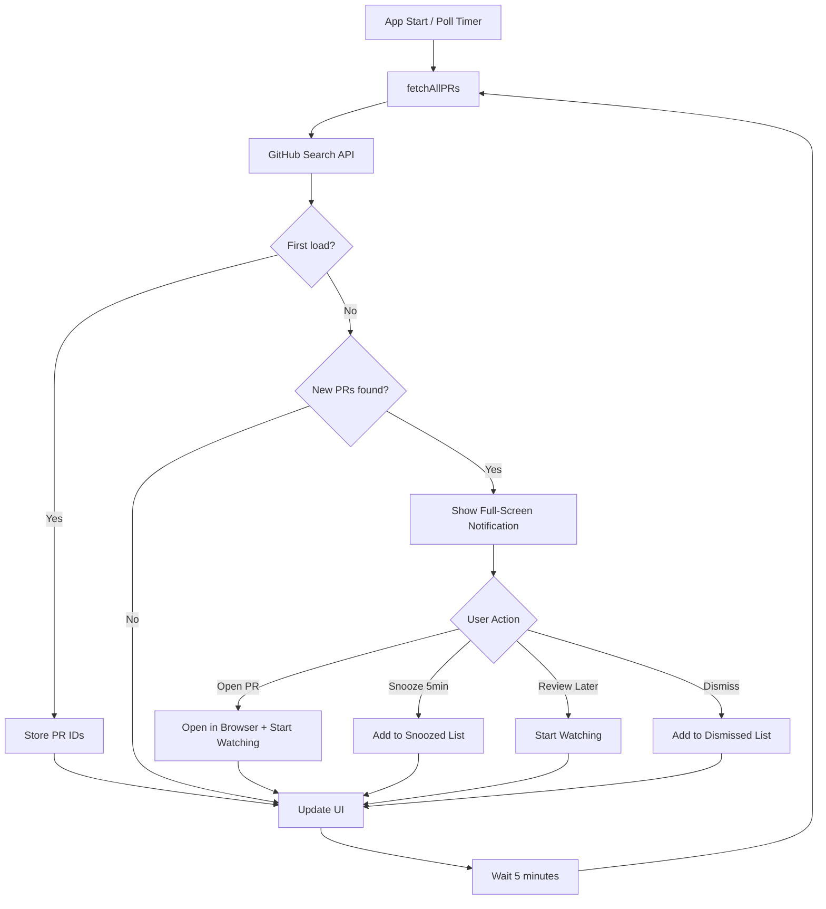
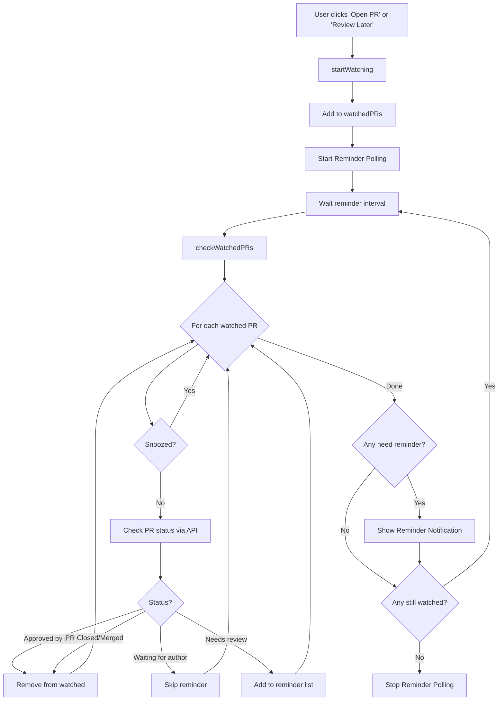
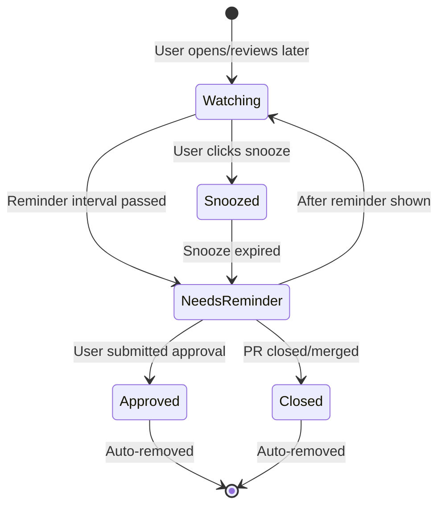
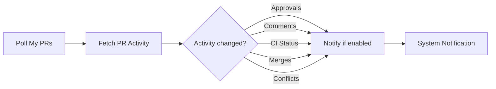

# Pulse Notification System

## Overview

Pulse has two notification systems:
1. **New PR Notifications** - Alert when new PRs where **you are personally requested** as a reviewer
2. **Review Reminders** - Remind you about PRs you opened but haven't reviewed yet

### What triggers New PR Notifications?

| Scenario | Notified? |
|----------|-----------|
| Someone requests **your** review specifically | ✅ Yes |
| PR assigned to your **team** | ❌ No (unless you're also requested) |
| PR in a repo you watch | ❌ No |
| PR you're mentioned in | ❌ No |
| PR you commented on | ❌ No |

The GitHub API query: `review-requested:{your_username}`

---

## System Architecture

```
┌─────────────────────────────────────────────────────────────────────────────┐
│                              PULSE APP                                       │
├─────────────────────────────────────────────────────────────────────────────┤
│                                                                              │
│  ┌──────────────────┐         ┌──────────────────┐                          │
│  │   PR Polling     │         │ Reminder Polling │                          │
│  │  (5 min default) │         │ (10 min default) │                          │
│  └────────┬─────────┘         └────────┬─────────┘                          │
│           │                            │                                     │
│           ▼                            ▼                                     │
│  ┌──────────────────┐         ┌──────────────────┐                          │
│  │ fetchAllPRs()    │         │ checkWatchedPRs()│                          │
│  │ - Awaiting Review│         │                  │                          │
│  │ - Involved       │         │                  │                          │
│  │ - My PRs         │         │                  │                          │
│  └────────┬─────────┘         └────────┬─────────┘                          │
│           │                            │                                     │
│           ▼                            ▼                                     │
│  ┌──────────────────┐         ┌──────────────────┐                          │
│  │ Compare with     │         │ Check PR status  │                          │
│  │ previousPRIds    │         │ via GitHub API   │                          │
│  └────────┬─────────┘         └────────┬─────────┘                          │
│           │                            │                                     │
│     New PRs?                     Needs reminder?                             │
│       │ YES                          │ YES                                   │
│       ▼                              ▼                                       │
│  ┌──────────────────────────────────────────────────────────────┐           │
│  │              PRNotificationWindowController                   │           │
│  │                  (Full-screen overlay)                        │           │
│  └──────────────────────────────────────────────────────────────┘           │
│                              │                                               │
│                              ▼                                               │
│                    ┌──────────────────┐                                      │
│                    │  User Actions:   │                                      │
│                    │  • Open PR       │                                      │
│                    │  • Snooze 5 min  │                                      │
│                    │  • Review Later  │                                      │
│                    │  • Dismiss       │                                      │
│                    └──────────────────┘                                      │
│                                                                              │
└─────────────────────────────────────────────────────────────────────────────┘
```

---

## New PR Notification Flow



---

## Review Reminder Flow



---

## Watched PR Status States



---

## Configuration Options

| Setting | Default | Description |
|---------|---------|-------------|
| Polling Interval | 5 min | How often to check for new PRs |
| Reminder Interval | 10 min | How often to remind about unreviewed PRs |
| Polling Enabled | Yes | Enable/disable auto-refresh |
| Reminders Enabled | Yes | Enable/disable review reminders |

---

## My PRs Activity Notifications

For PRs you authored, Pulse tracks activity changes:



Each notification type can be individually enabled/disabled in Settings.
